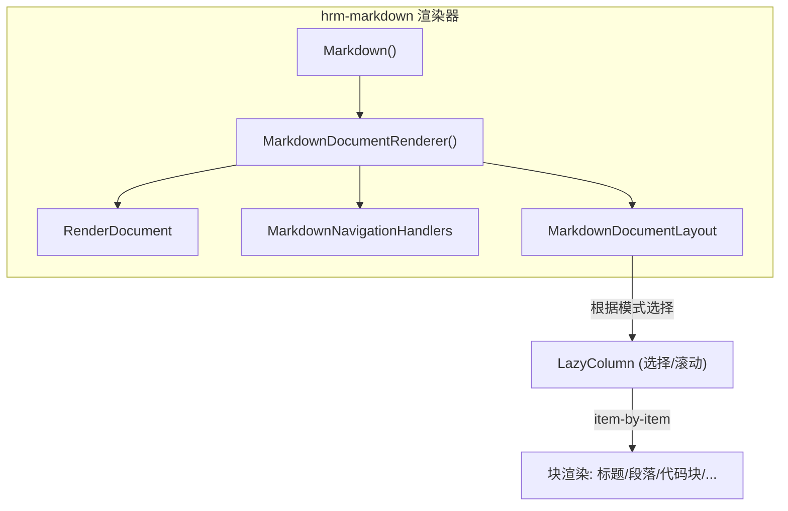
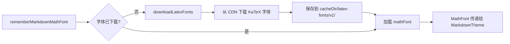
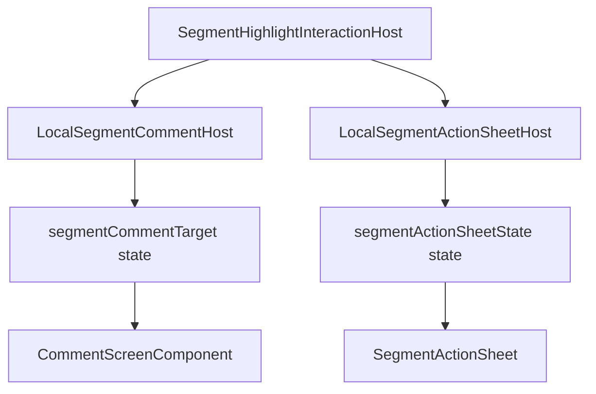

# Zhihu++ 文章/回答渲染逻辑分析

> 本文档系统梳理 Zhihu++ 的正文渲染架构。整个渲染流程可以分为：**数据获取 → HTML 预处理 → 渲染路径选择 → 双路径渲染**。
> 项目采用 Kotlin Multiplatform + Jetpack Compose Multiplatform，支持 Android 平台。

---

## 1. 整体架构概览

Zhihu++ 采用**双渲染路径**架构：

```
┌─────────────────────────────────────────────────────────┐
│                    数据层 (ViewModel)                     │
│  ArticleViewModel.loadArticle()                          │
│  → fetchContentDetail() → 原始 HTML                      │
│  → applySegmentInfosToHtml() → 注入分段高亮标记          │
│  → content state (String)                                │
└──────────────────────┬──────────────────────────────────┘
                       │
                       ▼
┌─────────────────────────────────────────────────────────┐
│                    视图层 (Screen)                        │
│  ArticleScreen.kt / PinScreen.kt / QuestionScreen.kt     │
│  → 根据 articleSettings.useWebView 选择渲染路径          │
└──────┬──────────────────────────────────────┬───────────┘
       │                                      │
       ▼                                      ▼
  ┌──────────┐  (主要路径)        ┌───────────────┐  (回退路径)
  │ WebView  │                    │ Compose       │
  │ 路径     │                    │ Markdown 路   │
  │          │                    │ 径            │
  │WebviewComp│                    │               │
  │(Android   │                    │ RenderMarkdown│
  │ WebView)  │                    │ → htmlToMdAst │
  │           │                    │ → Markdown()  │
  │CustomWeb  │                    │ → hrm 渲染器  │
  │View       │                    │ → 自定义      │
  │           │                    │ 图片/视频     │
  │loadZhihu()│                    │ 组件         │
  │           │                    │               │
  │stylesheet │                    │               │
  │.css       │                    │               │
  │(assets)   │                    │               │
  └──────────┘                    └───────────────┘
```

**关键设计决策：**
- **Compose Markdown 路径**是**主路径**，提供原生的文本选择、主题同步、分段高亮交互等能力。
- **WebView 路径**作为**紧急回退**存在（`ArticleWebViewContent` 注释中明确标注："WebView 正文渲染已经废弃，只保留为紧急回退路径"），用于在 Markdown 渲染出现问题时切换。

---

## 2. 数据获取与预处理

### 2.1 数据获取

数据获取入口位于 `shared/src/main/kotlin/com/github/zly2006/zhihu/viewmodel/ArticleViewModel.kt`：

```mermaid
sequence
  ViewModel as ArticleViewModel
  Env as ContentLoadEnvironment
  API as Zhihu API
  Data as DataHolder.Answer / .Article

  ViewModel->>Env: fetchContentDetail(article)
  Env->>API: HTTP GET
  API-->>Data: 返回JSON
  Data->>ViewModel: content (原始 HTML)
  ViewModel->>ViewModel: applySegmentInfosToHtml(...)
  ViewModel-->>State: content state
```

关键代码路径（`ArticleViewModel.kt:178`）：

```kotlin
fun loadArticle(environment: ArticleLoadEnvironment) {
    viewModelScope.launch {
        withContext(Dispatchers.Default) {
            try {
                if (article.type == ArticleType.Answer) {
                    val answer = environment.fetchContentDetail(article) as? DataHolder.Answer
                    if (answer != null) {
                        content = applySegmentInfosToHtml(
                            content = answer.content,
                            segmentInfos = answer.segmentInfos,
                            sourceUrl = "https://www.zhihu.com/question/${answer.question.id}/answer/${answer.id}",
                            contentId = answer.id.toString(),
                            contentType = "answer",
                        )
                        // ... 填充其他字段
                    }
                } else if (article.type == ArticleType.Article) {
                    // 类同处理，content = applySegmentInfosToHtml(...)
                }
            }
        }
    }
}
```

### 2.2 分段高亮注入 (`SegmentHighlightUtils.kt`)

知乎的"标注"功能（用户在他人回答上划词高亮标注）需要在渲染时显示出来。注入逻辑位于 `shared/src/main/kotlin/com/github/zly2006/zhihu/util/SegmentHighlightUtils.kt`：

**核心函数 `applySegmentInfosToHtml`**（第147行）：
1. 使用 `Jsoup.parseBodyFragment(content)` 解析 HTML。
2. 遍历 `segmentInfos`（每个段落的标注信息）。
3. 定位到 `<p data-pid="...">` 元素。
4. 验证段落文本匹配，且不包含不支持的格式标签（仅 `b/strong/i/em` 支持）。
5. 清空原段落内容，用 `span.highlight-wrap` + `data-highlight-*` 属性替换。
6. 返回修改后的 HTML。

```kotlin
// 数据结构
data class SegmentHighlightSpan(
    val text: String,
    val meta: SegmentInfoMeta,
    val sourceUrl: String? = null,
    val contentId: String? = null,
    val contentType: String? = null,
    val paragraphId: String? = null,
    val startOffset: Int? = null,
    val endOffset: Int? = null,
)
```

---

## 3. 渲染路径选择

渲染路径选择发生在 `shared/src/main/kotlin/com/github/zly2006/zhihu/ui/ArticleScreen.kt`（第773行）：

```kotlin
if (articleSettings.useWebView) {
    // WebView 回退路径
    ArticleWebViewContent(
        article = article,
        html = viewModel.content,
        title = viewModel.title,
        scrollState = scrollState,
        ...
    )
} else {
    // Compose Markdown 主路径
    RenderMarkdown(
        html = viewModel.content,
        modifier = Modifier.articleMarkdownSelectionWorkaround(),
        ...
    )
}
```

`PinScreen.kt`（第611行）使用 `PinHtmlContent` 封装相同的切换逻辑：

```kotlin
fun PinHtmlContent(html: String) {
    if (rememberSettingsStore().getBoolean(ARTICLE_USE_WEBVIEW_PREFERENCE_KEY, false) &&
        supportsZhihuHtmlWebView()
    ) {
        ZhihuHtmlWebViewContent(html)
    } else {
        RenderMarkdown(html = html, selectable = true, enableScroll = false)
    }
}
```

> **注意**：`supportsZhihuHtmlWebView()` 目前始终返回 `true`（`UiSupportFiles.kt:728`），但在 Android 之外的平台（如桌面）WebView 不可用，因此 WebView 路径仅在 Android 平台生效。

---

## 4. 主路径：Compose Markdown 渲染

### 4.1 入口：`RenderMarkdown`

`shared/src/main/kotlin/com/github/zly2006/zhihu/markdown/RenderMarkdown.kt`（第234行）：

```kotlin
@Composable
fun RenderMarkdown(
    html: String,
    modifier: Modifier = Modifier,
    scrollState: ScrollState = rememberScrollState(),
    selectable: Boolean = true,
    enableScroll: Boolean = true,
    header: (@Composable () -> Unit)? = null,
    footer: (@Composable () -> Unit)? = null,
) {
    val document = remember(html) { htmlToMdAst(html) }
    RenderMarkdownDocument(document, modifier, scrollState, selectable, enableScroll, header, footer)
}
```

**两个入口函数：**
- `RenderMarkdown(html, ...)` — 接受知乎的原始 HTML。
- `RenderMarkdownText(markdown, ...)` — 接受 Markdown 文本（用于编辑器预览等场景），通过 `MarkdownParser().parse(markdown)` 解析。

### 4.2 HTML → Markdown AST 转换

转换入口 `htmlToMdAst(html, noNativeBlock = false)` 位于 `MdAst.kt`（第68行）：

```kotlin
fun htmlToMdAst(html: String, noNativeBlock: Boolean = false): Document {
    val document = Document()
    parsingDocument = document
    Ksoup.parseBodyFragment(html)       // 使用 Ksoup 解析 HTML
        .body()
        .childNodes()
        .convertNodesToBlocks(noNativeBlock)  // HTML节点 → Markdown AST 块
        .forEach(document::appendChild)
    document.footnoteDefinitions.forEach { document.appendChild(it) }
    document.assignStableLineRanges()
    return document
}
```

**转换流程详解：**

```
HTML (Ksoup Document)
    │
    │  childNodes() → 遍历顶层节点
    │
    ▼
┌─────────────────────────────────────────────────┐
│ convertNodesToBlocks / convertElementToBlock    │
│                                                 │
│  HTML标签 → Markdown AST 节点类型:               │
│  • h1-h6  → Heading                              │
│  • p      → Paragraph                            │
│  • blockquote → BlockQuote                       │
│  • pre    → FencedCodeBlock                      │
│  • ul/ol  → ListBlock                            │
│  • hr     → ThematicBreak                        │
│  • img    → Figure / Image                       │
│  • figure → Figure                               │
│  • table  → Table                                │
│  • div    → 递归展开子节点                       │
│  • a.video-box → NativeBlock（视频箱）           │
│                                                 │
│  inline元素 → extractInlineNode:                │
│  • strong/b → StrongEmphasis                     │
│  • em/i     → Emphasis                           │
│  • del/s    → Strikethrough                      │
│  • mark     → Highlight                          │
│  • span.highlight-wrap → SegmentHighlight        │
│  • sup[data-draft-type=reference] → FootnoteReference│
│  • code     → InlineCode                         │
│  • a        → Link                               │
│  • br       → HardLineBreak                      │
│  • img      → InlineMath / MathBlock (公式检测)  │
│  • kbd      → KeyboardInput                      │
└─────────────────────────────────────────────────┘
    │
    ▼
Markdown AST (Document)
```

**关键转换细节：**

1. **图片 URL 提取** `extractImageUrl`（`ZhihuUtils.kt:119`）：
   ```kotlin
   fun extractImageUrl(attribute: (String) -> String): String? =
       attribute("data-original-token").takeIf { it.startsWith("v2-") }?.let { "https://pic1.zhimg.com/$it" }
       ?: attribute("data-original")?.takeIf { it.isNotBlank() }
       ?: attribute("data-default-watermark-src")?.takeIf { it.isNotBlank() }
       ?: attribute("data-actualsrc")?.takeIf { it.isNotBlank() }
       ?: attribute("data-thumbnail")?.takeIf { it.isNotBlank() }
       ?: attribute("src")?.takeIf { it.isNotBlank() }
   ```
   按优先级依次尝试多个知乎图片属性。

2. **公式检测** `extractEquationTex`（`MdAst.kt:534`）：
   ```kotlin
   private fun extractEquationTex(imgElement: Element): String? = extractImageUrl(imgElement::attr)
       ?.takeIf { it.startsWith("https://www.zhihu.com/equation?tex=") }
       ?.let { Url(it).parameters["tex"].orEmpty() }
       ?.takeIf { it.isNotBlank() }
   ```
   知乎将 LaTeX 公式渲染为 `` 标签（`src` 指向 `equation?tex=...`），检测后提取 `tex` 参数，转换为 `InlineMath` 或 `MathBlock` AST 节点。

3. **视频链接** `createVideoBoxBlock`（`MdAst.kt:404`）：
   - 检测 `<a class="video-box">` 元素。
   - 从 `href` 或 `data-lens-id` 提取视频 ID。
   - 如果 `noNativeBlock=false`（默认），创建 `NativeBlock { RenderVideoBox(...) }` —— 嵌入 Compose 组件。
   - 如果 `noNativeBlock=true`（用于导出），创建普通 `Link` 节点。

4. **链接重定向清理** `normalizeLinkDestination`（`MdAst.kt:687`）：
   ```kotlin
   private fun normalizeLinkDestination(href: String): String =
       if (href.contains("link.zhihu.com")) {
           runCatching { Url(href).parameters["target"] }.getOrNull()?.takeIf { it.isNotBlank() } ?: href
       } else {
           href
       }
   ```
   知乎的外链通过 `link.zhihu.com` 重定向，这里提取真实目标 URL。

5. **脚注**（`MdAst.kt:593`）：
   - 检测 `<sup data-draft-type="reference">` → `FootnoteReference` + `FootnoteDefinition`。

### 4.3 主题与用户偏好应用

`RenderMarkdownDocument`（`RenderMarkdown.kt:277`）读取用户偏好并应用主题：

```kotlin
@Composable
private fun RenderMarkdownDocument(
    document: Document, modifier: Modifier, scrollState: ScrollState,
    selectable: Boolean, enableScroll: Boolean,
    header: (@Composable () -> Unit)?, footer: (@Composable () -> Unit)?,
) {
    val previewImageUrls = remember(document) { document.previewImageUrls() }
    val navigator = LocalNavigator.current
    val mathFont = rememberMarkdownMathFont()       // KaTeX 数学字体
    val codeFontFamily = rememberMarkdownCodeFontFamily()  // 等宽字体
    val settings = rememberSettingsStore()
    val fontSize = settings.getInt(PREF_FONT_SIZE, 100)       // 默认 100%
    val lineHeight = settings.getInt(PREF_LINE_HEIGHT, 160)    // 默认 160%
    val blockSpacing = settings.getInt(PREF_BLOCK_SPACING, 100) // 默认 100%

    val scaledFontSize = 16f * fontSize / 100
    val scaledLineHeight = scaledFontSize * lineHeight / 100
    val scaledCodeFontSize = 14f * fontSize / 100
    val scaledCodeLineHeight = scaledCodeFontSize * lineHeight / 100

    val defaultTheme = MarkdownTheme.material3()  // 从 Material 3 颜色方案生成
    val theme = defaultTheme.copy(
        bodyStyle = defaultTheme.bodyStyle.copy(
            fontSize = scaledFontSize.sp,
            lineHeight = scaledLineHeight.sp,
        ),
        codeBlockStyle = defaultTheme.codeBlockStyle.copy(
            fontSize = scaledCodeFontSize.sp,
            lineHeight = scaledCodeLineHeight.sp,
            letterSpacing = 0.sp,
            fontFamily = codeFontFamily,
        ),
        blockSpacing = defaultTheme.blockSpacing * (blockSpacing / 100f),
        mathFontSize = 18f * fontSize / 100,
        mathFont = mathFont ?: defaultTheme.mathFont,
    )

    // CompositionLocal 提供器：分段高亮点击回调
    CompositionLocalProvider(
        LocalSegmentCommentHost provides { target -> segmentCommentTarget = target },
        LocalSegmentActionSheetHost provides { state -> segmentActionSheetState = state },
    ) {
        SegmentHighlightInteractionHost {
            Markdown(
                document = document,
                imageContent = { data, imageModifier ->
                    RenderImage(data, imageModifier, previewImageUrls)
                },
                onLinkClick = { url ->
                    resolveContent(url)?.let { navigator.onNavigate(it) }
                        ?: openExternalUrl(url)
                },
                header = header, footer = footer, theme = theme,
            )
        }
    }
}
```

### 4.4 hrm-markdown 渲染引擎

Markdown AST 最终由第三方库 `com.hrm.markdown` 渲染。核心文件位于 `third_party/markdown/markdown-renderer/`：

- **`Markdown.kt`** — 顶层 Composable 入口，接受 `markdown: String` 或 `document: Document`，自动解析并渲染。
- **`MarkdownDocumentRenderer.kt`** — 内部渲染器，负责：
  - 根据 `enableSelection`/`enableScroll`/`isStreaming` 选择渲染模式（`resolveMarkdownRenderMode`）
  - 管理 LaTeX 渲染缓存 (`LocalLatexRenderCache`)
  - 创建 `RenderDocument`（异步解析 AST → RenderNode 树）
  - 设置导航处理器（链接点击、脚注跳转）
  - 通过 `ProvideRendererContext` 将回调注入 CompositionLocal



渲染器通过 `MarkdownTheme`（`third_party/markdown/markdown-renderer/src/commonMain/kotlin/com/hrm/markdown/renderer/MarkdownTheme.kt`）管理样式，`material3()` 方法将 Material 3 颜色方案映射到 Markdown 主题。

### 4.5 自定义图片渲染 (`RenderImage`)

`RenderMarkdown.kt:84` 中的 `RenderImage` 是自定义的图片渲染组件，替代了 hrm-markdown 的默认图片渲染：

```kotlin
@Composable
fun RenderImage(
    data: MarkdownImageData,
    modifier: Modifier,
    imageUrls: List<String> = listOf(data.url),
) {
    val openImageGallery = rememberImageGalleryOpener()
    val saveImage = rememberImageSaver()
    val shareImage = rememberImageSharer()
    var expanded by remember { mutableStateOf(false) }

    Box(modifier = Modifier.fillMaxWidth(), contentAlignment = Alignment.Center) {
        AsyncImage(
            model = rememberMarkdownImageModel(data.url),  // Coil3，带认证cookie
            modifier = modifier
                .fillMaxWidth(0.8f)
                .then(if (imageAspectRatio != null) Modifier.aspectRatio(imageAspectRatio) else Modifier)
                .pointerInput(Unit) {
                    detectTapGestures(
                        onTap = { openGallery() },          // 点击预览
                        onLongPress = {                      // 长按菜单
                            expanded = true
                        },
                    )
                },
        )
        DropdownMenu(expanded = expanded, ...) {
            DropdownMenuItem("查看图片") { openGallery() }     // 进入轮播图
            DropdownMenuItem("在浏览器中打开") { openExternalUrl(data.url) }
            DropdownMenuItem("保存图片") { saveImage(data.url) }
            DropdownMenuItem("分享图片") { shareImage(data.url) }
        }
    }
}
```

图片加载使用 **Coil3** (`coil3.compose.AsyncImage`)，通过 `rememberMarkdownImageModel` 构建带认证 Cookie 的 `ImageRequest`：

```kotlin
@Composable
fun rememberMarkdownImageModel(url: String): Any {
    val context = LocalPlatformContext.current
    val headerData = rememberMarkdownImageRequestHeaders()
    val headers = remember(headerData.cookieHeader, headerData.userAgent) {
        NetworkHeaders.Builder()
            .set("Cookie", headerData.cookieHeader)
            .set("User-Agent", headerData.userAgent)
            .build()
    }
    return remember(context, url, headers) {
        ImageRequest.Builder(context)
            .data(url).httpHeaders(headers).build()
    }
}
```

点击图片进入**轮播图**模式，`previewImageUrls` 通过 `document.previewImageUrls()` 收集所有 `Figure` 和 `Image` 节点的 URL，支持在同一文章的所有图片间滑动浏览。

### 4.6 视频渲染 (`RenderVideoBox`)

视频链接通过 `createVideoBoxBlock` 在 AST 中转换为 `NativeBlock`，渲染时显示缩略图 + 播放图标：

```kotlin
@Composable
fun RenderVideoBox(
    videoId: Long,
    thumbnailUrl: String?,
    modifier: Modifier = Modifier,
) {
    val navigator = LocalNavigator.current
    Box(
        modifier = modifier
            .fillMaxWidth()
            .aspectRatio(16f / 9f)
            .clip(RoundedCornerShape(8.dp))
            .background(MaterialTheme.colorScheme.surfaceVariant)
            .clickable { navigator.onNavigate(Video(videoId)) },
    ) {
        if (thumbnailUrl != null) {
            AsyncImage(model = rememberMarkdownImageModel(thumbnailUrl), ...)
        }
        Surface(modifier = Modifier.align(Alignment.Center), ...) {
            Icon(Icons.Default.PlayArrow, "播放视频", tint = Color.White)
        }
    }
}
```

点击后通过 `LocalNavigator` 导航到 `Video` 目的地。

---

## 5. 回退路径：Android WebView 渲染

WebView 路径位于 `shared/src/main/kotlin/com/github/zly2006/zhihu/ui/components/WebviewComp.kt`：

### 5.1 `WebviewComp` Compose 包装器

```kotlin
@Composable
fun WebviewComp(
    scrollState: ScrollState = ...,
    onContentHeight: ((Int) -> Unit)? = null,
    content: @Composable (CustomWebView) -> Unit,
) {
    AndroidView(
        factory = { context ->
            CustomWebView(context) { webView ->
                content(webView)
            }
        },
        modifier = Modifier.fillMaxWidth().height(scrollState.maxValue + padding),
    )
}
```

### 5.2 `CustomWebView.loadZhihu`

WebView 加载通过 `loadDataWithBaseURL` 加载 HTML，关键步骤：

```kotlin
fun loadZhihu(url: String, document: Document, additionalStyle: String = "") {
    val settings = androidSettingsStore(context)
    val fontSize = settings.getInt(PREF_FONT_SIZE, 100)
    val lineHeight = settings.getInt(PREF_LINE_HEIGHT, 160)

    val bodyClass = if (ThemeManager.isDarkTheme) " class=\"dark-theme\" " else ""

    loadDataWithBaseURL(
        url,
        """
        <head>
        <link rel="stylesheet" href="https://zhihu-plus.internal/assets/stylesheet.css">
        <viewport content="width=device-width, initial-scale=1.0">
        </viewport>
        <style>
        body {
            font-size: $fontSize%;
            line-height: ${lineHeight / 100f};
        }
        $additionalStyle
        </style>
        </head>
        <body $bodyClass>
        ${document.body().html()}
        </body>
        """.trimIndent(),
        "text/html", "utf-8", null,
    )
}
```

**WebView 路径的特性：**
- 使用 `stylesheet.css` 资产文件作为基础样式表（`app/src/main/assets/stylesheet.css`）。
- 通过 `bodyClass` 添加 `dark-theme` 类切换深浅色（CSS 中的 `.dark-theme` 选择器）。
- 字体大小和行高通过内联 `<style>` 调整。
- **滚动控制**：WebView 的 `scrollTo` 被重写为 `super.scrollTo(0, 0)`，并禁止自己滚动，所有滚动通过 `scrollToHeightCallback` 回调到 Compose 层（`WebviewComp.kt:208`）。
- **点击处理**：通过 `click-listener.js`（`app/src/main/assets/click-listener.js`） JS 接口监听 `` 和 `.video-box` 点击，回调到 `htmlClickListener`。
- **高度上报**：通过 `injectContentHeightReporter()` JS 脚本上报内容高度到 Compose 层。
- **懒加载图片**：`prepareContentDocument`（`ArticleWebViewSupport.kt`）处理 `<noscript>` 标签中的懒加载图片。
- **长按菜单**：通过 `setOnCreateContextMenuListener` + `HitTestResult` 实现图片长按保存/分享。

---

## 6. 辅助渲染系统

### 6.1 表情渲染 (`EmojiManager.kt`)

表情通过 Compose 的 `InlineTextContent` + `InlineTextContent` 渲染，支持在 Markdown 文本中显示 Emoji 图片。

```kotlin
// EmojiManager.kt
object EmojiManager {
    // 从 assets/emojis/emoji_mapping.json 加载 placeholder → 文件名映射
    fun getEmojiPath(placeholder: String): String? // → "emojis/xxxx.webp"
    fun getEmojiPathByFileName(fileName: String): String?
}

// ContentRenderingUtils.kt:184
fun createEmojiInlineContent(context: Context, emojiKeys: Set<String>): Map<String, InlineTextContent> {
    return emojiKeys.filter { it.startsWith("emoji_") }.mapNotNull { emojiKey ->
        val fileName = emojiKey.removePrefix("emoji_")
        val path = EmojiManager.getEmojiPathByFileName(fileName) ?: return@mapNotNull null
        val bitmap = context.assets.open(path).use { BitmapFactory.decodeStream(it) }
        emojiKey to InlineTextContent(placeholder = Placeholder(...)) {
            Image(bitmap = bitmap.asImageBitmap(), ...)
        }
    }.toMap()
}
```

Emoji 数据文件：`app/src/main/assets/emojis/emoji_mapping.json` 映射占位符到文件名。

### 6.2 LaTeX / 数学渲染

数学公式通过动态下载 KaTeX 字体实现，位于 `shared/src/main/kotlin/com/github/zly2006/zhihu/markdown/LatexFontDownloader.kt`：



```kotlin
@Composable
fun rememberMarkdownMathFont(): MathFont? {
    val context = LocalContext.current
    val httpClient = AccountData.httpClient(context)
    return rememberLatexFonts(context, httpClient).downloaded?.mathFont
}
```

下载逻辑：
- 镜像源：npmmirror, USTC, Tsinghua（依次重试）。
- 字体缓存路径：`cacheDir/latex-fonts/v1/`。
- 下载完成后状态流转：`IDLE → DOWNLOADING → READY | ERROR`。
- 字体包括：KaTeX主字体、KaTeX数学字体、Latin Modern Math。

代码字体：`rememberMarkdownCodeFontFamily()` 优先使用 `KaTeX Typewriter` 字体（包含完整框线字符），回退到 `FontFamily.Monospace`。

### 6.3 主题系统

主题通过 `MarkdownTheme.material3()` 从 Material 3 颜色方案生成。关键文件：`third_party/markdown/markdown-renderer/src/commonMain/kotlin/com/hrm/markdown/renderer/MarkdownTheme.kt`。

```kotlin
val defaultTheme = MarkdownTheme.material3()
val theme = defaultTheme.copy(
    bodyStyle = defaultTheme.bodyStyle.copy(
        fontSize = scaledFontSize.sp,
        lineHeight = scaledLineHeight.sp,
    ),
    mathFont = mathFont ?: defaultTheme.mathFont,
    // ...
)
```

WebView 路径通过 `ThemeManager.isDarkTheme` 检测深浅色，并添加 `dark-theme` CSS 类。

### 6.4 分段高亮交互

分段高亮的点击交互通过 CompositionLocal + 自定义 ModifierNode 实现：



在 `RenderMarkdownDocument` 中：
- `LocalSegmentCommentHost` 接收 `SegmentHighlight` 点击，设置 `segmentCommentTarget`，触发 `CommentScreenComponent` 显示。
- `LocalSegmentActionSheetHost` 接收 ActionSheet 状态，显示 `SegmentActionSheet`。
- `SegmentHighlightInteractionHost` 包装整个 `Markdown` 组件，提供 `Modifier.markdownInlineTaps()` 用于检测高亮区域的短按。

hrm-markdown 渲染器的 `SegmentHighlightInteraction.kt`（第31行）实现了一个自定义 `ModifierNodeElement`，监听划线文字上的点击事件，同时保留原生的文本选择手势（长按拖动、选择手柄）。

---

## 7. 内容类型渲染的应用

### 7.1 文章/回答 (ArticleScreen.kt)

```
ArticleScreen
├── ArticleScreenSettingsState (运行时设置)
├── topBar: TopAppBar
├── content:
│   ├── if (useWebView) → ArticleWebViewContent (WebView)
│   └── else → RenderMarkdown (Compose Markdown) ← [主路径]
├── bottomBar: 点赞/收藏/评论
└── 滚动手势处理 (双击滑动隐藏/显示 UI)
```

关键分支（`ArticleScreen.kt:773`）：
```kotlin
if (articleSettings.useWebView) {
    ArticleWebViewContent(...)
} else {
    RenderMarkdown(html = viewModel.content, ...)
}
```

### 7.2 问题详情 (QuestionScreen.kt)

```kotlin
// QuestionDetailContent 通过 supportsZhihuHtmlWebView 切换
@Composable
fun QuestionDetailContent(question: DataHolder.Question, html: String) {
    if (...useWebView...) {
        ZhihuHtmlWebViewContent(html)
    } else {
        RenderMarkdown(html = html, selectable = true, enableScroll = false)
    }
}
```

### 7.3 想法 (PinScreen.kt)

```kotlin
// PinHtmlContent 统一切换逻辑
@Composable
fun PinHtmlContent(html: String) {
    if (shouldUseWebView) ZhihuHtmlWebViewContent(html)
    else RenderMarkdown(html = html, selectable = true, enableScroll = false)
}
```

### 7.4_feed卡片 (FeedCard.kt)

Feed 卡片使用 `parseEmphasizedHtmlTextWithTheme()` 解析 HTML `<em>` 标签为主题色 `AnnotatedString`，而非完整渲染：

```kotlin
// HtmlText.kt
fun parseEmphasizedHtmlTextWithTheme(text: String, ...): AnnotatedString {
    // 使用 Jsoup 解析 <em> 标签 → AnnotatedString with Primary色
}
```

### 7.5 热榜/资讯 (DailyScreen.kt)

Zhihu Daily 故事通过 `resolveContent(url)` 解析 URL → NavDestination，导航到对应详情页（通常是 `Article`）。

---

## 8. 导出功能 (HTML / Markdown / 图片)

导出功能位于 `shared/src/main/kotlin/com/github/zly2006/zhihu/util/ArticleExportCommonUtils.kt` 和 `ContentRenderingUtils.kt`：

### 8.1 HTML 导出

```kotlin
fun buildArticleExportHtml(
    loadAssetText: (String) -> String,
    exportData: ArticleExportData,
    extraSectionsHtml: String = "",
): String = renderArticleExportHtml(
    template = loadAssetText("article_export_template.html"),
    exportData = exportData,
    extraSectionsHtml = extraSectionsHtml,
)
```

模板文件：`app/src/main/assets/article_export_template.html`，使用 `{{placeholder}}` 模板语法替换标题、作者、正文、页脚等内容。

**导出流程：**
1. `buildArticleExportData(content)` 构建导出数据结构。
2. `renderArticleExportHtml` 填充模板占位符。
3. `prepareArticleExportContentHtml(content)` 清理 HTML（移除 `noscript`、处理懒加载图片、清理 `srcset`）。
4. 离线导出时 (`buildOfflineArticleExportHtml`)：通过 `inlineArticleExportImagesInHtml` 将图片下载为 `data:` URL，实现完全离线。

### 8.2 Markdown 导出 (剪贴板)

```kotlin
// MdAst.kt:724
fun zhihuHtmlToMarkdown(html: String): String = htmlToMdAst(html, noNativeBlock = true).toMarkdown().trim()
```

使用 `noNativeBlock = true`，避免 `NativeBlock`（视频组件）在 Markdown 输出中丢失，转为普通链接。

### 8.3 图片导出

通过 `WebChromeClient` 拦截下载，或 `WebviewComp` 的长按菜单保存/分享。

---

## 9. 导航与内容解析 (`NavDestination.kt`)

URL→目的地解析位于 `shared/src/main/kotlin/com/github/zly2006/zhihu/navigation/NavDestination.kt`：

| URL 模式 | 目的地类型 |
|---------|-----------|
| `/question/{id}/answer/{id}` | `Article(type=Answer)` |
| `/article/{id}` | `Article(type=Article)` |
| `/question/{id}` | `Question` |
| `/p/{id}` | `Pin` |
| `/video/{id}` | `Video` |
| `/people/{urlToken}` | `Person` |
| `/topic/{id}` | `Topic` |
| `/search/...` | `Search` |
| `/collection/...` | `Collections` |

```kotlin
fun resolveContent(url: String): NavDestination? {
    // 解析知乎 URL → 具体的 NavDestination
}
```

链接点击回调（`RenderMarkdownDocument.kt`）：
```kotlin
onLinkClick = { url ->
    resolveContent(url)?.let { navigator.onNavigate(it) }
        ?: openExternalUrl(url)
}
```

---

## 10. 项目模块结构

```
zhihu-plus-plus/
├── app/                          # Android 应用入口
│   └── src/main/assets/
│       ├── article_export_template.html
│       ├── stylesheet.css
│       ├── click-listener.js
│       ├── footnotes.js
│       └── emojis/emoji_mapping.json
├── shared/                       # KMP 共享代码
│   ├── src/main/kotlin/com/github/zly2006/zhihu/
│   │   ├── markdown/
│   │   │   ├── MdAst.kt          # HTML → AST 转换 (核心)
│   │   │   ├── RenderMarkdown.kt # Compose 渲染 (图片/视频/主题/分段)
│   │   │   ├── MarkdownRuntime.kt  # 图片请求/字体/认证
│   │   │   └── LatexFontDownloader.kt # KaTeX 字体下载
│   │   ├── ui/
│   │   │   ├── ArticleScreen.kt  # 文章页 (渲染分支)
│   │   │   ├── QuestionScreen.kt # 问题页
│   │   │   ├── PinScreen.kt      # 想法页
│   │   │   ├── HomeScreen.kt     # 首页 feed
│   │   │   └── components/
│   │   │       └── WebviewComp.kt  # Android WebView 包装
│   │   ├── util/
│   │   │   ├── ArticleExportCommonUtils.kt # 导出逻辑
│   │   │   ├── SegmentHighlightUtils.kt # 分段高亮
│   │   │   └── ContentRenderingUtils.kt # Emoji/导出/图片保存
│   │   ├── navigation/
│   │   │   └── NavDestination.kt # URL → 目的地解析
│   │   └── viewmodel/
│   │       └── ArticleViewModel.kt # 数据获取 + 内容预处理
│   ├── third_party/markdown/     # hrm-markdown 渲染引擎
│   │   ├── markdown-parser/      # Markdown/AST 解析
│   │   └── markdown-renderer/    # Compose 渲染器
└── settings.gradle.kts
```

---

## 11. 关键设计决策总结

| 决策 | 描述 | 利弊 |
|-----|------|------|
| **双渲染路径** | Compose Markdown + Android WebView | Compose 主动，WebView 回退 |
| **HTML → AST** | 通过 Ksoup + 自定义转换器 | 保留知乎 HTML 的语义，但转换层维护成本 |
| **NativeBlock** | 视频/等原生组件通过 AST 嵌入 | 灵活，但破坏 AST 的纯数据特性 |
| **CompositionLocal** | 通过 CompositionLocalProvider 传递分段高亮回调 | 解耦渲染器与业务逻辑 |
| **动态字体下载** | KaTeX 字体按需下载 | 首次渲染延迟；网络依赖 |
| **Asset-based CSS** | WebView 使用 asset CSS + inline 样式 | 样式管理集中，但不能动态更新字体 |
| **Segment Highlighter** | 通过 `<span class="highlight-wrap">` 注入 | 与原生 WebView 隔离，但转换逻辑复杂 |
